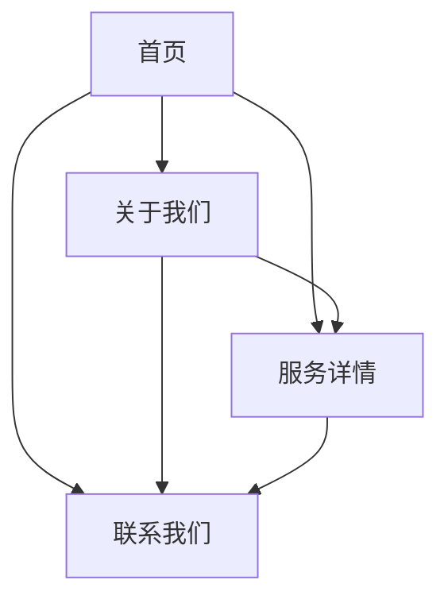

## 1. 产品概述
米酒科技企业官网，展示公司形象、核心服务和价值主张的专业企业网站。
- 目标用户：潜在客户、合作伙伴、求职者等对企业感兴趣的访问者
- 产品价值：建立企业形象，展示服务能力，促进商业合作

## 2. 核心功能

### 2.1 用户角色
| 角色 | 注册方式 | 核心权限 |
|------|----------|----------|
| 访客用户 | 无需注册 | 浏览网站内容、查看服务信息、提交联系表单 |

### 2.2 功能模块
企业官网包含以下主要页面：
1. **首页**：英雄区、三项核心服务展示、使命愿景、价值主张、联系CTA
2. **关于我们**：公司介绍、团队信息、发展历程
3. **服务详情**：各项服务的详细介绍
4. **联系我们**：联系信息、地图位置、在线表单

### 2.3 页面详情
| 页面名称 | 模块名称 | 功能描述 |
|-----------|-------------|-------------|
| 首页 | 英雄区 | 展示企业标语、核心价值主张，包含视觉冲击力强的背景图像 |
| 首页 | 三项服务 | 展示企业三大核心服务，每项服务包含图标、标题、简要描述 |
| 首页 | 使命愿景 | 阐述企业使命、愿景和价值观，增强品牌认知 |
| 首页 | 价值主张 | 突出企业竞争优势和独特价值 |
| 首页 | 联系CTA | 明显的联系按钮，引导用户采取行动 |
| 关于我们 | 公司介绍 | 详细介绍企业发展历程、核心团队 |
| 服务详情 | 服务展示 | 各项服务的详细说明、特点、优势 |
| 联系我们 | 联系表单 | 用户可填写姓名、邮箱、电话、留言内容 |
| 联系我们 | 联系信息 | 展示公司地址、电话、邮箱等基本信息 |

## 3. 核心流程
访问者浏览流程：
1. 访问首页 → 浏览英雄区和核心价值 → 查看三项服务 → 了解使命愿景 → 点击联系CTA
2. 访问首页 → 导航到关于我们 → 了解公司详情 → 导航到服务详情 → 查看具体服务 → 导航到联系我们 → 提交联系表单

## 4. 用户界面设计

### 4.1 设计风格
- 主色调：深蓝色 (#1e3a8a) 和白色，体现科技感和专业性
- 按钮样式：圆角矩形，悬停效果，现代化扁平设计
- 字体：中文使用思源黑体，英文使用Roboto，标题20-32px，正文14-16px
- 布局风格：卡片式布局，清晰的分区设计，顶部导航栏
- 图标风格：线性图标，简洁现代，与服务内容相匹配

### 4.2 页面设计概览
| 页面名称 | 模块名称 | UI元素 |
|-----------|-------------|-------------|
| 首页 | 英雄区 | 全屏背景图，居中标题文字，渐变遮罩，醒目的CTA按钮 |
| 首页 | 三项服务 | 三栏卡片布局，图标+标题+描述，悬停动画效果 |
| 首页 | 使命愿景 | 两栏布局，左侧文字右侧图片，现代简约风格 |
| 首页 | 价值主张 | 数字或图标突出显示，强调关键数据 |
| 首页 | 联系CTA | 醒目的按钮设计，使用对比色，固定在页面底部 |

### 4.3 响应式设计
采用桌面优先设计，支持平板和手机自适应：
- 桌面端：1200px以上，完整展示所有内容
- 平板端：768px-1199px，适当调整布局和字体大小
- 手机端：767px以下，采用单列布局，简化导航