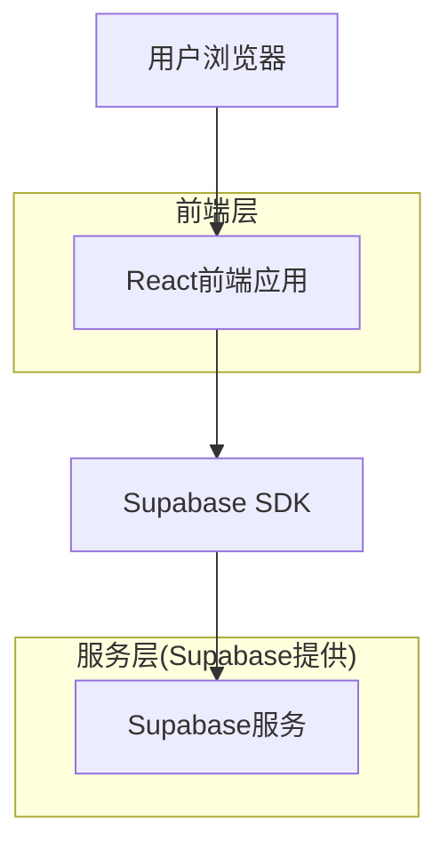
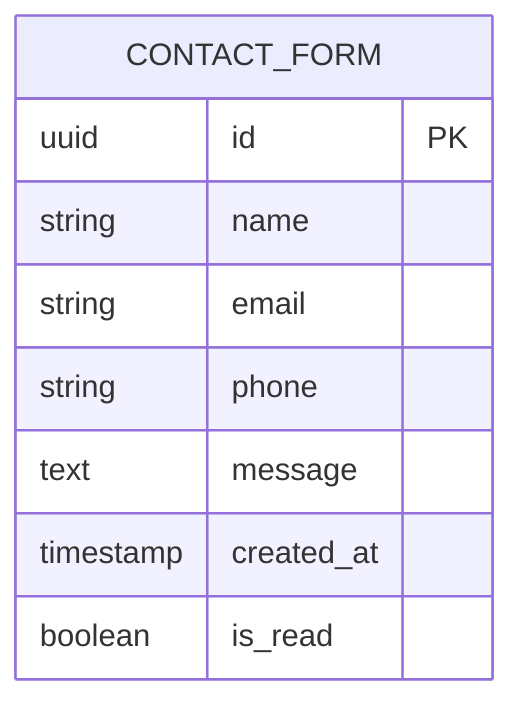

## 1. 架构设计



## 2. 技术描述

- 前端：React@18 + tailwindcss@3 + vite
- 初始化工具：vite-init
- 后端：无（使用Supabase作为后端服务）
- 数据库：Supabase (PostgreSQL)
- 部署：静态网站托管

## 3. 路由定义

| 路由 | 用途 |
|-------|---------|
| / | 首页，展示企业核心信息和服务 |
| /about | 关于我们页面，公司详细介绍 |
| /services | 服务详情页面，各项服务介绍 |
| /contact | 联系我们页面，联系表单和信息 |

## 4. API定义

### 4.1 核心API

联系表单提交
```
POST /api/contact
```

请求参数：
| 参数名 | 参数类型 | 是否必需 | 描述 |
|-----------|-------------|-------------|-------------|
| name | string | true | 联系人姓名 |
| email | string | true | 联系邮箱 |
| phone | string | false | 联系电话 |
| message | string | true | 留言内容 |
| created_at | timestamp | false | 提交时间 |

响应参数：
| 参数名 | 参数类型 | 描述 |
|-----------|-------------|-------------|
| status | boolean | 提交状态 |
| message | string | 响应消息 |

示例：
```json
{
  "name": "张三",
  "email": "zhang@example.com",
  "phone": "13800138000",
  "message": "对贵公司的服务很感兴趣，希望了解更多详情"
}
```

## 5. 数据模型

### 5.1 数据模型定义



### 5.2 数据定义语言

联系表单表 (contact_forms)
```sql
-- 创建表
CREATE TABLE contact_forms (
    id UUID PRIMARY KEY DEFAULT gen_random_uuid(),
    name VARCHAR(100) NOT NULL,
    email VARCHAR(255) NOT NULL,
    phone VARCHAR(20),
    message TEXT NOT NULL,
    created_at TIMESTAMP WITH TIME ZONE DEFAULT NOW(),
    is_read BOOLEAN DEFAULT FALSE
);

-- 创建索引
CREATE INDEX idx_contact_forms_created_at ON contact_forms(created_at DESC);
CREATE INDEX idx_contact_forms_email ON contact_forms(email);

-- 权限设置
GRANT SELECT ON contact_forms TO anon;
GRANT INSERT ON contact_forms TO anon;
GRANT ALL PRIVILEGES ON contact_forms TO authenticated;
```

## 6. 组件架构

### 6.1 页面组件结构
```
src/
├── components/
│   ├── Header.jsx          # 顶部导航
│   ├── Hero.jsx            # 英雄区
│   ├── Services.jsx        # 三项服务展示
│   ├── Mission.jsx         # 使命愿景
│   ├── ValueProposition.jsx # 价值主张
│   ├── ContactCTA.jsx      # 联系CTA
│   ├── Footer.jsx          # 页脚
│   └── ContactForm.jsx     # 联系表单
├── pages/
│   ├── Home.jsx            # 首页
│   ├── About.jsx           # 关于我们
│   ├── Services.jsx        # 服务详情
│   └── Contact.jsx         # 联系我们
├── utils/
│   └── supabase.js         # Supabase客户端配置
└── App.jsx                 # 主应用组件
```

### 6.2 状态管理
- 使用React内置的useState和useEffect进行组件状态管理
- 联系表单数据通过Supabase实时同步
- 页面间的状态通过React Router进行传递